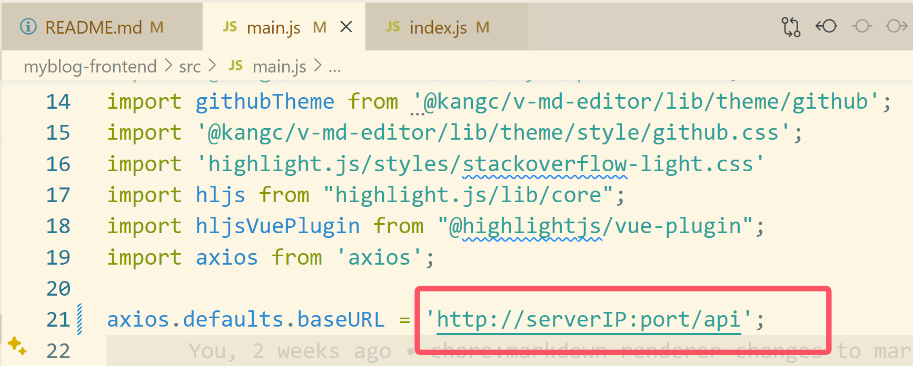
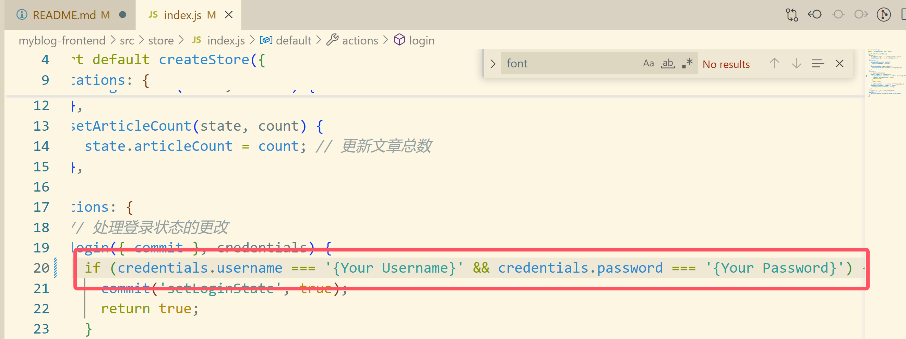

# 个人博客
## 技术栈
* springboot
* vue3
* mysql
------
README仅介绍如何运行项目，具体实现细节请参考个人博客内容

## 前期准备
* JDK版本:21（17以上都可以）
* node版本:v16.20.2
* mysql:v5.6
* 由于使用阿里云的oss时验证方式我选择了AK方式，两个密钥都是放在环境变量里的，配置方式参考[阿里云oss+Java配置使用教程](https://help.aliyun.com/zh/oss/developer-reference/java-installation?spm=a2c4g.11186623.0.i1 "阿里云oss+Java配置使用教程")
* **注意配置环境变量之后可能需要重启电脑**
## 运行方式
### 后端
* 数据库文件在myblog-backend文件夹下的src/main/resources下的BlogData.sql
* 创建一个数据库，名字叫my_blog
* 运行BlogData.sql文件，创建数据表
* 连接数据库的用户名和密码在myblog-backend文件夹下的src/main/resources下的application.properties中，修改为自己的mysql用户名和密码
* 进入myblog-backend文件夹，输入
    ```shell
    mvn spring-boot:run
    ```
### 前端：进入myblog-frontend文件夹
* 修改main.js文件的baseURL
    
    这里改为http://localhost:8080/api
* 修改store/index.js中的用户名和密码为你自己的
    * 
* 运行项目
    ```shell
    npm run install
    # 如果需要修改前端并及时显示效果
    npm run serve
    ```